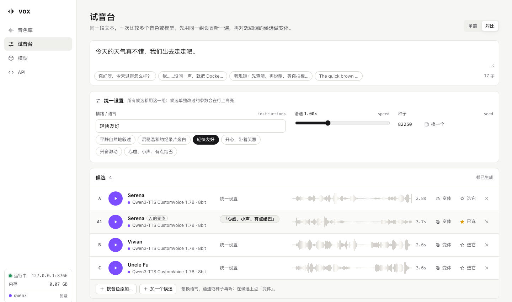
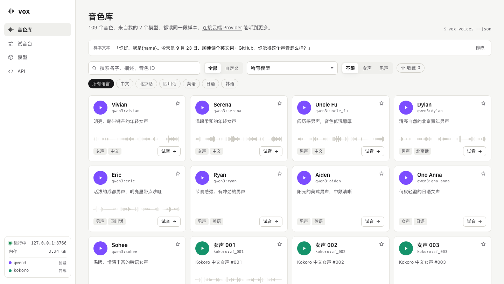
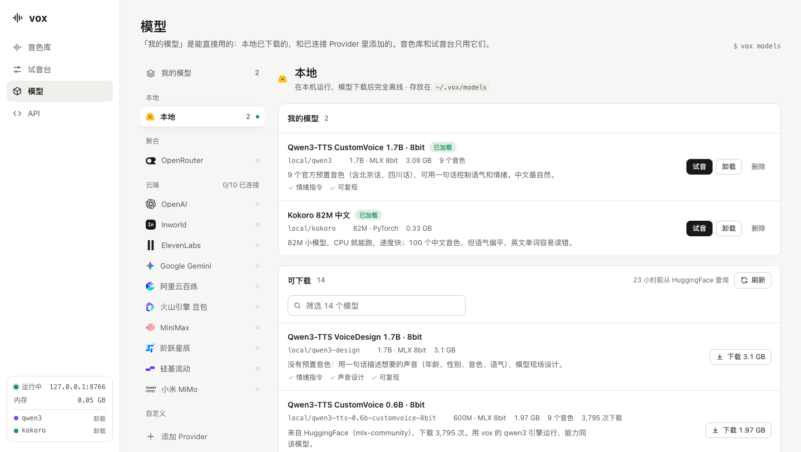

# vox

**一个接口，调用所有 TTS 模型：本地和云端。**
像 LM Studio 管理大模型一样管理语音合成模型，像 OpenRouter 一样用一套接口调用它们。

[English](README.md) · 中文

> **预览版（0.1）。** 作者日常在用，但还有不少粗糙的地方。网页界面和命令行提示目前**只有中文**，英文界面在计划中。本地模型需要 **Apple Silicon 的 Mac**。



## 能做什么

- **一套词汇。** 命令行、HTTP API、网页用同一套模型 ID、音色引用和参数名（`model`、`voice`、`instructions`、`speed`、`seed`）。所有命令都支持 `--json`，服务还提供 `/llms.txt`，Agent 和人一样好用。
- **OpenAI 兼容。** `POST /v1/audio/speech`：任何 OpenAI 客户端把地址换成 `http://127.0.0.1:8765/v1`，就能用你的全部模型。
- **本地模型，离线运行。** Qwen3-TTS（CustomVoice 和 VoiceDesign，`mlx-community` 发布的各尺寸、各量化版本）和 Kokoro-82M 中文版。下载时逐个文件按 HuggingFace 的哈希校验。
- **云端 Provider，同一套接口。** OpenRouter 加 10 家厂商（见下表）。各家的差异，比如情绪指令放哪、语速范围、音频是 base64 / hex / 临时链接 / 分块返回，都由适配器处理。
- **自定义 Provider。** 接入任何 OpenAI 兼容的语音服务：自己部署的 Kokoro-FastAPI、代理、vox 还没收录的厂商，或者另一台 vox。
- **先听再选。** 音色库里每个音色都读同一段样本；试音台有对比模式：同一段文本、同一组语气 / 语速 / 种子，几个音色或模型排成清单，一键同时生成（先给费用预估）；想单独调其中一个，就基于它做变体，和原来的并排比较。

| 音色库 | 模型与 Provider |
| --- | --- |
|  |  |

## 环境要求

- 本地模型需要 Apple Silicon 的 Mac（基于 [MLX](https://github.com/ml-explore/mlx) 运行）。云端和自定义 Provider 只是 HTTP 调用，但目前只在 macOS 上测试过。
- Python 3.10 以上（推荐 3.12）和 [uv](https://docs.astral.sh/uv/)。
- `ffmpeg`（`brew install ffmpeg`），用于格式转换和变速。
- 可选：[`coli`](https://www.npmjs.com/package/@marswave/coli)，用于读音校对（本地语音识别）。没有也不影响其他功能。

## 安装

```bash
uv tool install --python 3.12 git+https://github.com/Aryous/vox
vox serve --open            # 网页界面：http://127.0.0.1:8765
```

包名是 `vox-tts`，命令是 `vox`。

参与开发：

```bash
git clone https://github.com/Aryous/vox && cd vox
uv venv --python 3.12 && uv pip install -e .
.venv/bin/python tests/test_providers.py     # 39 项离线测试，约 1 秒
```

## 快速上手

```bash
vox models --all                          # vox 认识的全部模型，以及现在能不能用
vox models add qwen3                      # 下载 Qwen3-TTS CustomVoice 1.7B（约 3 GB）
vox say "今天天气不错。" -m qwen3 -v serena -i "轻快友好" --seed 42 --play
vox say "Hello from vox." -m qwen3 -v ryan -o hello.mp3
vox voices -m qwen3                       # 某个模型的音色
vox serve --open                          # 网页界面 + API
```

Kokoro 第一次使用时会自动下载（约 330 MB）。Qwen3 默认从 ModelScope 镜像下载（国内快得多），并按 HuggingFace 的哈希校验；`vox pull qwen3 --source hf` 可以直接从 HuggingFace 下载。

### 从任何 OpenAI 客户端调用

```python
from openai import OpenAI

client = OpenAI(base_url="http://127.0.0.1:8765/v1", api_key="vox")  # 本地服务不校验 Key
with client.audio.speech.with_streaming_response.create(
    model="local/qwen3", voice="serena", input="你好", instructions="轻快友好",
    extra_body={"seed": 42},              # vox 扩展：固定种子，结果可复现
) as r:
    r.stream_to_file("hi.mp3")
```

同样的请求默认直接返回上次的结果；传 `cache: false`（CLI 用 `--no-cache`）会重新合成，适合没有种子的云端模型再来一条。响应头带 `X-Vox-Id`、`X-Vox-Seed`、`X-Vox-Duration`。原生 JSON 接口（`/api/models`、`/api/voices`、`/api/speech`……）见网页的 API 页或 `GET /llms.txt`。

## 模型与 Provider

**我的模型**是现在就能用的模型：已下载的本地模型，加上已连接的 Provider 里你添加的模型。音色库、试音台和 `/v1/models` 只显示它们。模型「能不能用」（下没下载、有没有 Key）由 vox 判断，不是一个让你拨的开关。

| 来源 | 模型 | 状态 |
| --- | --- | --- |
| 本地 | Qwen3-TTS CustomVoice / VoiceDesign（0.6B–1.7B，4bit 到 bf16）、Kokoro-82M 中文 | ✅ 已测试 |
| OpenRouter | 它的全部 TTS 模型（Fish Audio、MAI-Voice、Grok Voice、Deepgram Aura……），在线获取，不用 Key 也能浏览 | 模型列表 ✅ · 合成 ⚠️ |
| Google Gemini | `gemini-3.8-flash-tts`、`gemini-3.8-flash-lite-tts` | ✅ 用真 Key 测试过 |
| OpenAI、Inworld、ElevenLabs | `gpt-4o-mini-tts`、`inworld-tts-2(-flash)`、`eleven_v3` / `flash_v2_5` / `multilingual_v2` | ⚠️ 实验性 |
| 阿里云百炼、火山豆包、MiniMax、阶跃星辰、硅基流动、小米 MiMo | Qwen-Audio / CosyVoice / Qwen3-TTS 云端版、豆包语音合成 2.0、Speech 2.8、StepAudio、CosyVoice2、MiMo TTS | ⚠️ 实验性 |
| 自定义 | 任何 OpenAI 兼容的语音服务 | ✅ 已测试（自建、不要 Key） |

⚠️ **实验性**：适配器按各家官方文档实现，离线测试按文档里的请求和响应逐项核对过，用故意填错的 Key 请求真实接口也返回了鉴权错误；但还没有人用真 Key 跑过。如果你有 Key，欢迎试用，成功失败都请开个 issue。

有公开模型列表的 Provider，可以用 `vox models fetch <provider>`（或网页上的「在线查询」）获取最新列表。vox 注册表里没有的模型，会借用同一家已登记模型的请求格式，并标记为「能力推断」。

### Key

```bash
vox keys list                     # 每家需要什么、配了没有、去哪申请
vox keys set GEMINI_API_KEY       # 交互输入，不回显，不进 shell 历史
```

环境变量优先于凭证文件（`~/.config/vox/credentials.json`，权限 600）。Key 不会通过 API 返回，也不写进日志；界面只显示末 4 位。

### 自定义 Provider

```bash
vox providers add my-kokoro --base-url http://127.0.0.1:8880/v1 --no-key --instructions none
vox providers test my-kokoro      # 试连：查 {base}/models 和 {base}/audio/voices
vox models -p my-kokoro --all && vox models add my-kokoro/kokoro
```

vox 调用 `POST {base}/audio/speech`，从 `GET {base}/models` 读模型列表，从 `GET {base}/audio/voices` 读音色（也可以手动填）。兼容选项可以设置情绪指令放在哪、服务支不支持 `speed`（不支持就由 ffmpeg 变速）。vox 自己也提供 `GET /v1/audio/voices`，所以一台 vox 可以把另一台当 Provider 接入。网页上：模型 → 添加 Provider。

## 统一的名字

| | 命令行 | HTTP | 例子 |
| --- | --- | --- | --- |
| 模型 | `-m` | `model` | `local/qwen3`、`qwen3`、`gemini/gemini-3.8-flash-tts` |
| 音色 | `-v` | `voice` | `serena`，或带上模型的引用：`qwen3:serena`、`my:<id>` |
| 情绪 / 声音描述 | `-i` | `instructions` | `"轻快友好"`；声音设计模型里是对声音的描述 |
| 语速 | `-s` | `speed` | `0.25`–`4` |
| 种子 | `--seed` | `seed` | 支持的模型可以复现同一版声音 |

## 命令行

| 命令 | 作用 |
| --- | --- |
| `vox models [--all] [-p provider]` | 我的模型（或全部）和状态 |
| `vox models fetch / add / rm / update` | 在线查询某家的模型 · 加进我的模型（本地模型会下载）· 移出（本地要加 `--delete-files`）· 更新注册表 |
| `vox pull <模型>` | 前台下载本地模型 |
| `vox load / unload <模型>` | 预加载进运行中的服务 / 从内存卸载 |
| `vox voices` · `vox sample <引用> --play` | 浏览音色 · 试听音色样本 |
| `vox say <文本>` | 合成（`-` 从标准输入读；`-o 文件.mp3`；`--play`） |
| `vox batch script.json` | 多角色脚本批量合成，只重做改动过的句子 |
| `vox history [--star]` | 合成历史，和网页共享 |
| `vox keys` · `vox providers` | 凭证 · Provider（包括自定义的） |
| `vox serve` · `vox status` | 网页 + API · 服务状态和文件位置 |

服务在运行时，`say`、`sample`、`load`、`unload` 会交给服务执行，直接用内存里已经加载的模型；加 `--local` 强制在当前进程合成。

### 批量合成脚本（`vox batch`）

```json
{
  "defaults": {"model": "qwen3"},
  "voices": {
    "N": {"voice": "uncle_fu", "instructions": "沉稳的纪录片旁白"},
    "C": {"voice": "my:narrator"},
    "L": {"model": "kokoro", "voice": "zm_010", "speed": 1.1}
  },
  "lines": [
    {"id": "intro", "who": "N", "s": "屏幕上显示的文字", "v": "可选：实际朗读的文字"},
    {"who": "C", "s": "单句也可以覆盖 instructions", "instructions": "有点心虚"}
  ]
}
```

也支持 `scenes[].lines`（文件命名 `sXX_YY`，并输出网页可以直接加载的 `timing.js`）。

## 文件放在哪里

| | 位置 | 内容 |
| --- | --- | --- |
| 数据 | `~/.vox` | 合成结果、音色样本、历史、我的音色、设置、我的模型、自定义 Provider |
| 模型 | `~/.vox/models` | 本地模型文件（已排除出 Time Machine，能重新下载） |
| 缓存 | `~/Library/Caches/vox`（其他系统为 `~/.cache/vox`） | 在线模型列表、云端音色列表、新版注册表，删了会自动重新获取 |
| Key | `~/.config/vox/credentials.json` | 权限 600；环境变量优先 |

`VOX_HOME` 可以把全部内容挪走（适合便携使用或测试）；`VOX_MODELS`、`VOX_CACHE`、`VOX_CONFIG` 分别单独指定。Kokoro 的文件在 HuggingFace 的缓存目录里。

数据放 `~/.vox` 而不是 `~/Library/Application Support`：这些数据要被命令行、本地服务、Agent 和将来的桌面 App 共用，和 Codex（`~/.codex`）、LM Studio（`~/.lmstudio`）、Ollama（`~/.ollama`）一样；路径短、没有空格，各系统一致。

## 注册表

`vox/registry.json` 是数据，不是代码：有哪些 Provider、怎么连接，以及 vox 推荐的模型的核对过的信息（能力、价格、音色）。`vox/providers/` 里的适配器负责「怎么调用」，注册表负责「有什么」。`vox models update` 会从本仓库拉取最新的注册表，所以修正模型信息不用发新版本。只有比本地更新的注册表才会生效；需要当前版本没有的适配器时，会提示你升级。

## 参与贡献

新增一家 Provider：在 `vox/providers/` 写一个 `CloudEngine` 子类（OpenAI 兼容的只需要写注册表），在 `vox/registry.json` 登记，再按官方文档里的请求和响应加一条离线测试。各家的调研记录和官方文档出处见 [`docs/cloud-providers-2026-09.md`](docs/cloud-providers-2026-09.md)。

## 致谢

[Qwen3-TTS](https://huggingface.co/Qwen) · [Kokoro](https://huggingface.co/hexgrad/Kokoro-82M-v1.1-zh) · [mlx-audio](https://github.com/Blaizzy/mlx-audio) 和 [mlx-community](https://huggingface.co/mlx-community) 的转换版本 · [ModelScope](https://modelscope.cn) 镜像 · Provider 图标来自 [LobeHub Icons](https://github.com/lobehub/lobe-icons)（MIT）。

## 开源协议

[MIT](LICENSE)。模型权重从发布方下载，遵循各自的协议（Qwen3-TTS 和 Kokoro 都是 Apache-2.0）。
